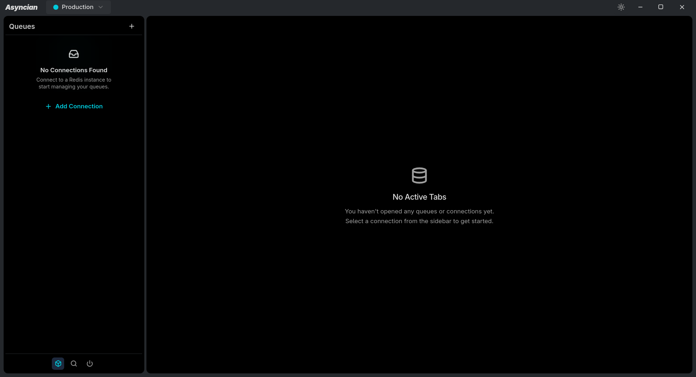
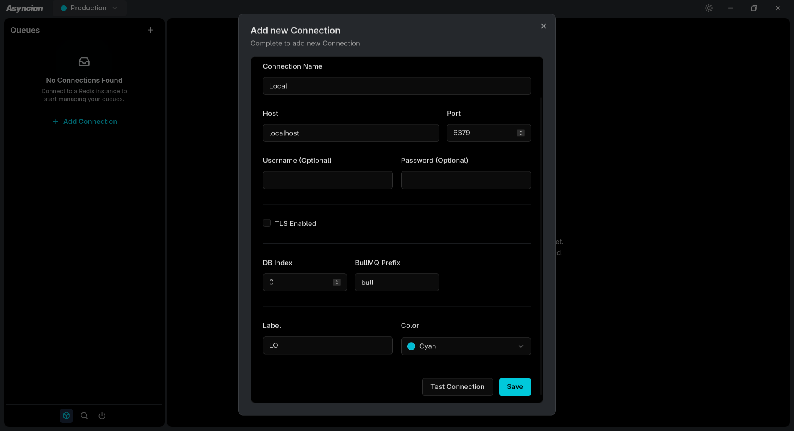
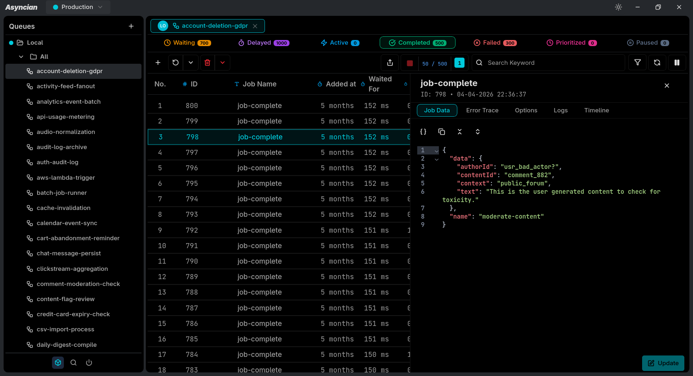
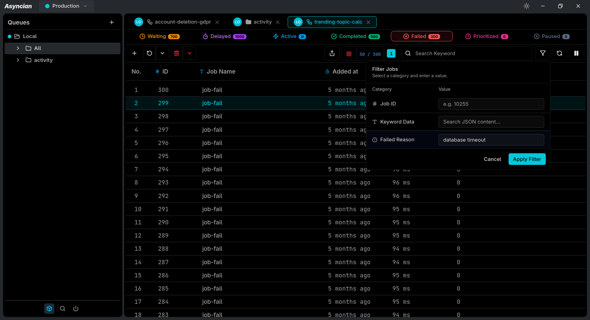
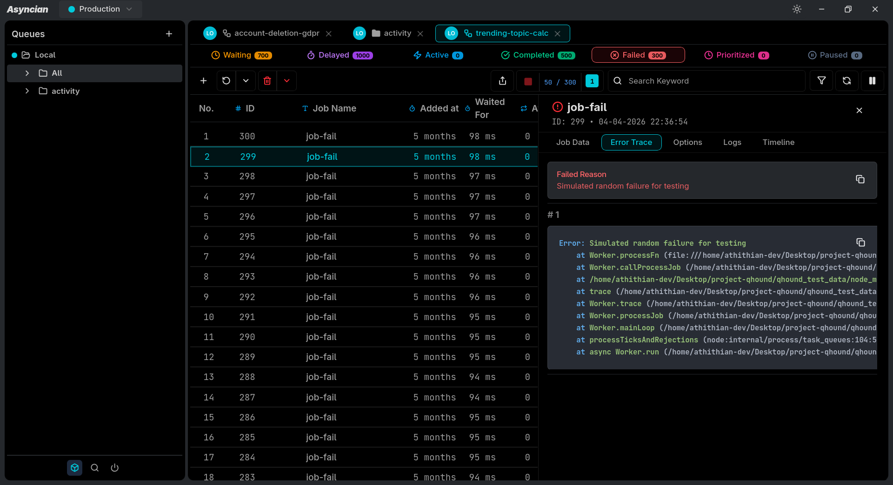
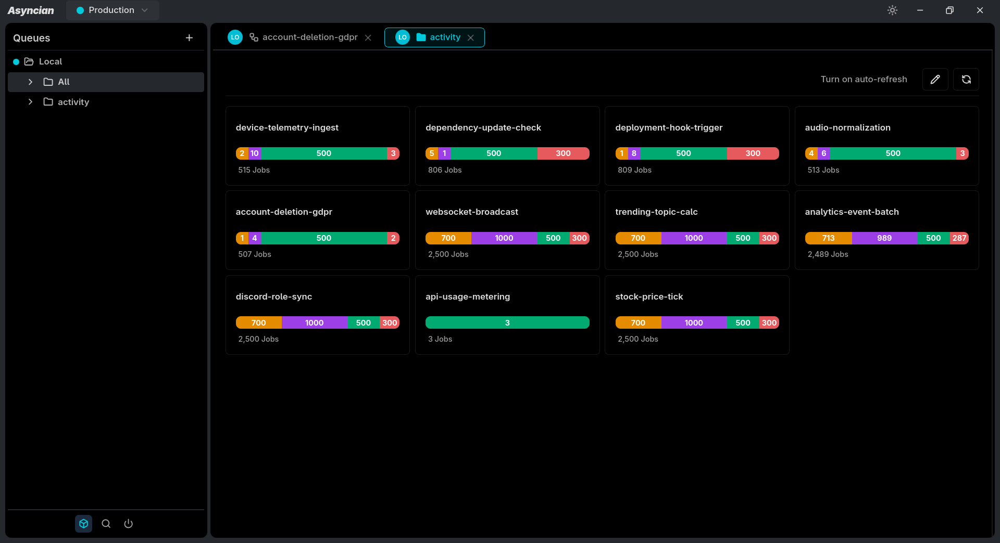
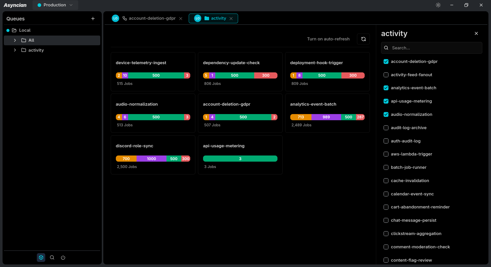

# Asyncian

### Aquarium of Queues

**A fast, native desktop application for managing, inspecting, and monitoring Redis & BullMQ queues.**

Asyncian gives developers a powerful interface for working with BullMQ queues directly from their desktop — inspect jobs, search queues, manage failures, organize queues into workspaces, and perform bulk operations without digging through Redis manually.

Built with **Rust, Tauri, Svelte, TypeScript, Redis, and BullMQ**.

---

## ✨ Why Asyncian?

Working with BullMQ queues often means switching between Redis tools, application logs, dashboards, and custom scripts just to answer simple questions:

> - What's in this queue?
> - Why did this job fail?
> - Can I retry these 50 jobs?
> - Where are my delayed jobs?

Asyncian brings those workflows into a single desktop application.

**Connect → Explore → Inspect → Manage.**

---

## 🚀 Features

### 🗂️ Queue Management

- Connect directly to Redis
- Browse all BullMQ queues from a tree-view sidebar
- Quickly search queues with `Ctrl + K`
- Organize related queues into folders
- Open multiple queues simultaneously using tabs

### 🔍 Job Inspection

- View jobs across all BullMQ states
- Browse jobs in a table-based interface
- Inspect complete job details
- View job payloads and metadata
- Inspect failed job information
- Search jobs within a queue

### ⚡ Job Operations

Perform operations on individual jobs or multiple jobs at once:

- Add jobs
- Update job data
- Delete jobs
- Bulk delete jobs
- Retry failed jobs
- Bulk retry failed jobs
- Promote delayed jobs
- Bulk promote delayed jobs

### 📊 Queue Monitoring

- Real-time queue monitoring
- Queue statistics and metrics
- Job state distribution
- Detailed job inspection

### 🖥️ Native Desktop Experience

Asyncian is built as a native desktop application using **Tauri + Rust**.

That means:

- Lightweight desktop footprint
- Native OS integration
- Fast startup
- Direct Redis connectivity
- Cross-platform support

**Windows · macOS · Linux**

---

## 🛠️ Tech Stack

| Technology     | Purpose                                          |
| -------------- | ------------------------------------------------ |
| **Rust**       | Native backend & performance-critical operations |
| **Tauri**      | Desktop application framework                    |
| **Svelte**     | Frontend UI                                      |
| **TypeScript** | Type-safe frontend development                   |
| **Redis**      | Queue storage                                    |
| **BullMQ**     | Queue/job management                             |

---

## 📸 Screenshots









---

## 🎥 Demo

Watch Asyncian in action:

**[Demo Video](https://www.youtube.com/watch?v=lWR9azwUais)**

---

## 🧑‍💻 Getting Started

### Prerequisites

Make sure you have the following installed:

- [Node.js](https://nodejs.org/)
- [Rust](https://www.rust-lang.org/)
- Redis
- Tauri prerequisites for your operating system

### Clone the repository

```bash
git clone https://github.com/athithianv/asyncian.git
cd asyncian
```

### Install dependencies

```bash
npm install
```

### Start development

```bash
npm run tauri dev
```

Asyncian can then connect to your local Redis instance:

```text
127.0.0.1:6379
```

---

## 🔌 Redis Connection

Asyncian connects directly to your Redis instance.

Example:

```text
Host:     127.0.0.1
Port:     6379
Password: ********
```

---

## 🗺️ Project Status

Asyncian is currently under active development.

The core queue and job management functionality is already available, while advanced search, security, performance improvements, flow management, and collaboration features are being developed.

---

## 🤝 Contributing

Contributions are welcome!

If you have an idea, bug report, feature request, or improvement:

1. Fork the repository
2. Create a feature branch
3. Make your changes
4. Test your changes
5. Open a pull request

Please read the contribution guidelines before submitting a PR.

---

## 💡 Feature Requests

Have an idea for Asyncian?

Open a GitHub issue and describe:

- The problem you're trying to solve
- Your proposed solution
- Why the feature would be useful
- Any examples or references

---

## 🔒 Security

If you discover a security vulnerability, please **do not open a public issue**.

Instead, follow the security reporting instructions in `SECURITY.md`.

---

## 📄 License

This project is licensed under the **MIT License**.

See [`LICENSE`](LICENSE) for details.

---

## ⭐ Support

If Asyncian is useful to you, consider giving the project a ⭐ on GitHub.

It helps the project get discovered and motivates further development.

---

<div align="center">

### Asyncian

**Aquarium of Queues**

Built for developers who spend too much time inside their queues.

**Redis · BullMQ · Rust · Tauri · Svelte**

</div>
